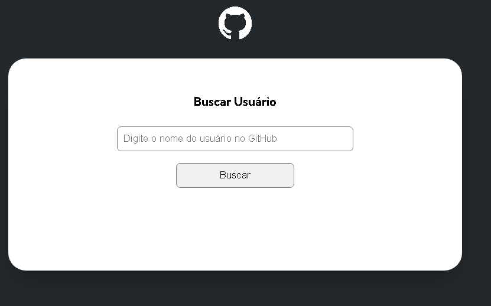

# projeto initial fetch github api

The project aims to practice the consumption of APL
and understand the usefulness of module for better organization of JavaScript files.

[]

## technologies used 

-html 

-css 

-js 

## how to use
 
1 - clone for the project
```
 git clone <url>
 
 ```

 2 -access the project folder
 ```
 cd repository-with-readme
